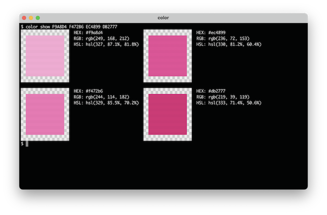

# colortools

Command-line tool for working with colors.

_Work in progress_

## Installation

__Prerequisites:__ [NodeJS](https://nodejs.org) `>=12.0.0`

Install with [npm](https://www.npmjs.com/get-npm):

    npm install @jimf/colortools --global

The `--global` flag is optional, but recommended.

Once installed, this package provides a `color` bin script.
Be sure to add this to your `$PATH`, or run with `npx color`.

## Usage

`color` exposes a number of sub-commands for working with colors.
For an overview of the available sub-commands, run:

    color help

For additional information on a given sub-command, append the sub-command name.
For example, to view the help on the `show` sub-command:

    color help show

### Available Commands

#### show

`show` is likely to be the most used command from this tool.
Like the name hopefully suggests, it can be used to show information on colors.
For each color specified, it will output a color swatch, as well as the hex, RGB, and HSL formats of that color.
Additionally, if any colors have been added to the color configuration (see the config command), the output will show if the color matches or is similar to any config colors.

Examples:

    color show c0ffee          # Base command, single color
    color show '#c0ffee'       # Quotes needed to use # (shell comment)
    color show 0,0,0           # RGB (NO SPACES)
    color show 'rgb(0, 0, 0)'  # Quotes needed to include spaces
    color show c0ffee 000000   # Any number of colors may be specified

The next set of examples assume a color palette has been configured:

    color show blue-500        # Show color info on a config color
    color show red-50 blue-50  # Again, multiple colors supported
    color show red-50 000000   # Config and regular colors can be mixed
    color show 'blue-*'        # Glob to match multiple config colors

See `color help show` for additional usage information.

#### config

`config` can be used to create, read, update, and delete your preferences for this tool.
Currently this only includes color data, but other preferences will likely be added in the future.

`config` overview:

    color config set <key> <value>    # Set a config value
    color config get <key>            # Get a config value
    color config delete <key>         # Delete a config value
    color config list                 # List config values

For working with colors, use the `colors` top-level key.
For example, the following will define `blue-500`:

    color config set colors.blue-500 3B82F6

Values will be run through the color parser, so any valid color format may be used for the values; not just hex.

Namespaces may be used to work with multiple color palettes.
For example:

    color config set colors.tailwind:blue-500 3B82F6

There is nothing special with regard to this `<namespace>:` syntax.
It's purely a convention I use.
The keys themselves are _just strings_.

__colortools__ adheres to the [XDG Base Directory Specification](https://specifications.freedesktop.org/basedir-spec/basedir-spec-latest.html), storing configuration data to `~/.config/@jimf/colortools/config.json`, where the `~/.config` portion can be overridden with the `XDG_CONFIG_HOME` environment variable.
Data is stored in JSON format, but this is an implementation detail that should not be relied upon.
Prefer the `color config` command for configuration CRUD.

## Motivation

My primary motivation with this tool was to solve workflow issues I regularly run into while turning design comps into actual code.
Great comps strictly adhere to a color palette, and provide color variables directly.
However, if I'm just working off of a screen grab, or raw hex codes, etc., it can be time consuming to translate color variables into their palette equivalents, particularly if the colors are close but not perfect.
With this tool, I can take these raw color values and very quickly translate them to the palettes I work with.

## License

[MIT](LICENSE)
